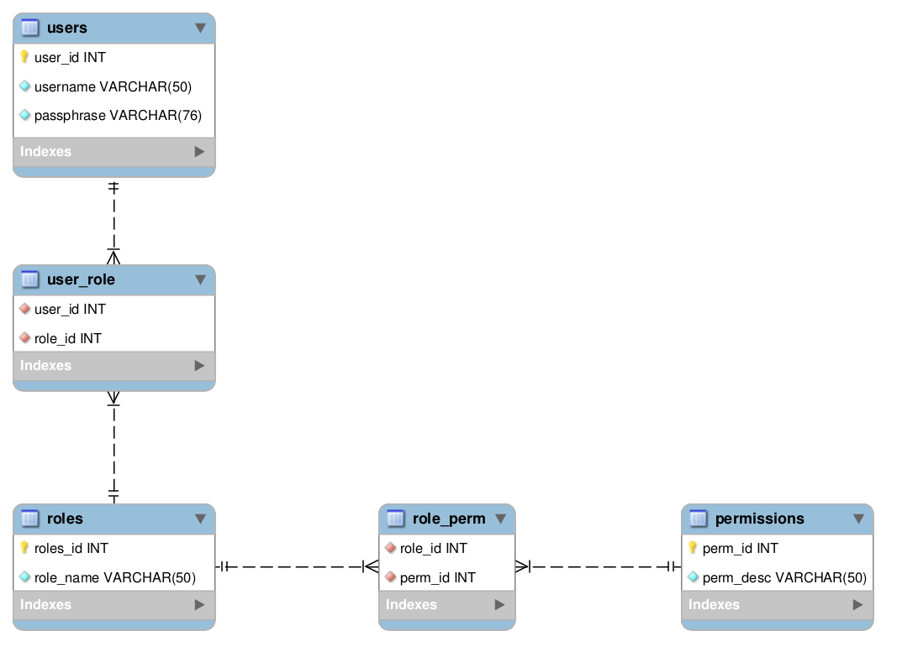

# City Cykler


## Rollebaseret adgangskontrol (RBAC)


Data struktur:
```sql
CREATE TABLE users (
  user_id INTEGER UNSIGNED NOT NULL AUTO_INCREMENT,
  username VARCHAR(50) NOT NULL,
  passphrase VARCHAR(76) NOT NULL,

  PRIMARY KEY (user_id)
);

CREATE TABLE roles (
  role_id INTEGER UNSIGNED NOT NULL AUTO_INCREMENT,
  role_name VARCHAR(50) NOT NULL,

  PRIMARY KEY (role_id)
);

CREATE TABLE permissions (
  perm_id INTEGER UNSIGNED NOT NULL AUTO_INCREMENT,
  perm_desc VARCHAR(50) NOT NULL,

  PRIMARY KEY (perm_id)
);

CREATE TABLE role_perm (
  role_id INTEGER UNSIGNED NOT NULL,
  perm_id INTEGER UNSIGNED NOT NULL,

  FOREIGN KEY (role_id) REFERENCES roles(role_id),
  FOREIGN KEY (perm_id) REFERENCES permissions(perm_id)
);

CREATE TABLE user_role (
  user_id INTEGER UNSIGNED NOT NULL,
  role_id INTEGER UNSIGNED NOT NULL,

  FOREIGN KEY (user_id) REFERENCES users(user_id),
  FOREIGN KEY (role_id) REFERENCES roles(role_id)
);
```

Vælg tilladelser for en rolle:
```sql
SELECT permissions.perm_desc
FROM role_perm

JOIN permissions
  ON role_perm.perm_id = permissions.perm_id

WHERE role_perm.role_id = :role_id
```

Vælg tilhørende rollenavne for en bruger:
```sql
SELECT user_role.role_id, roles.role_name
FROM user_role

JOIN roles
  ON user_role.role_id = roles.role_id

WHERE user_role.user_id = :user_id
```

Vælg alle tilladelser for en bruger:
```sql
SELECT permissions.perm_desc
FROM user_role

JOIN roles
  ON user_role.role_id = roles.role_id
JOIN role_perm
  ON roles.role_id = role_perm.role_id
JOIN permissions
  ON role_perm.perm_id = permissions.perm_id

WHERE user_role.user_id = :user_id
```